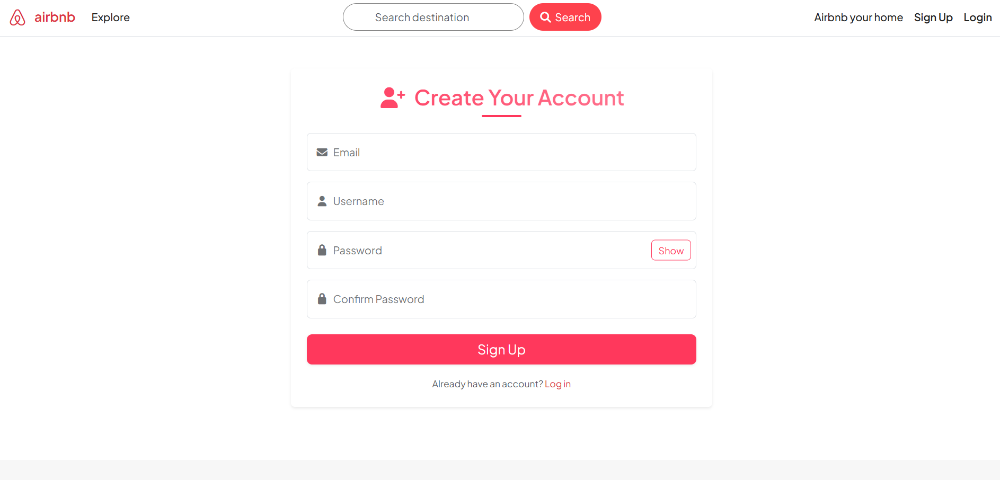
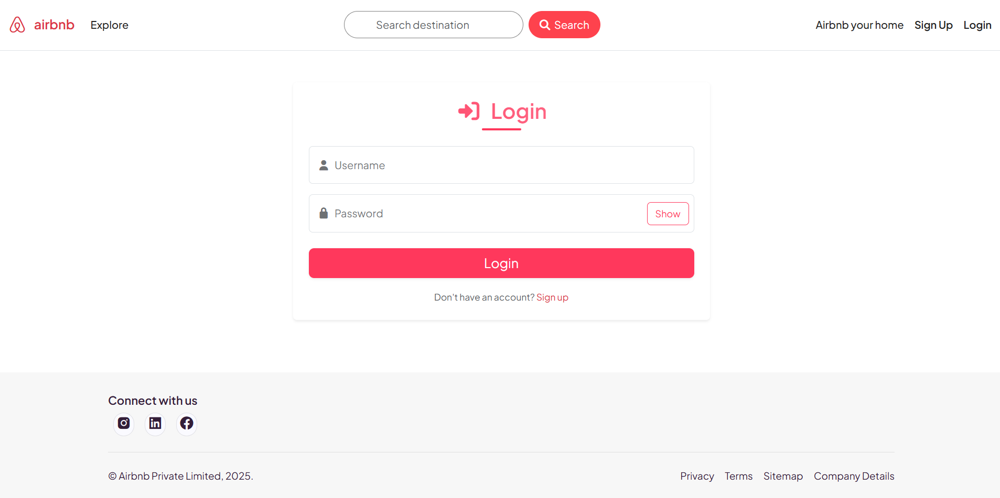
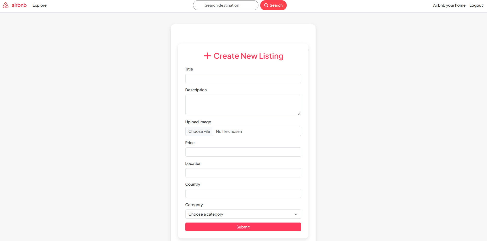
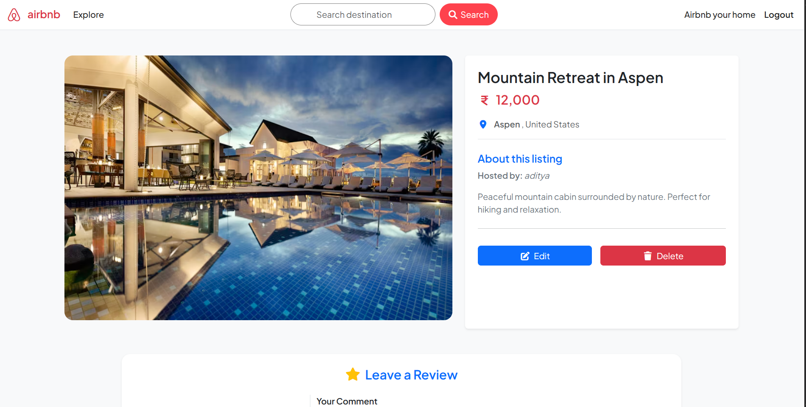
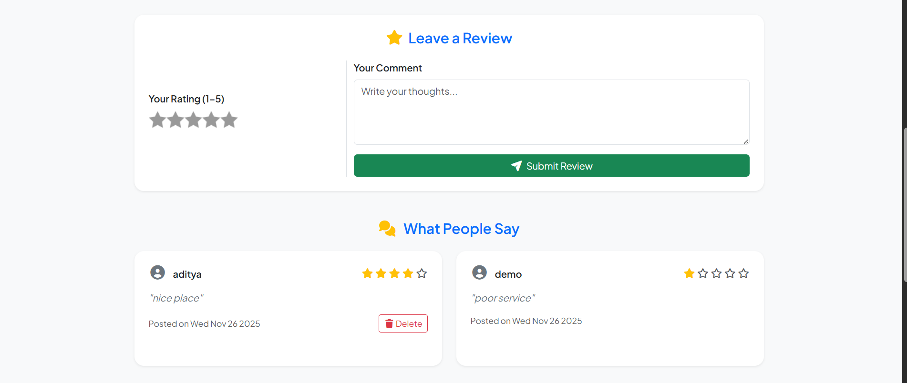
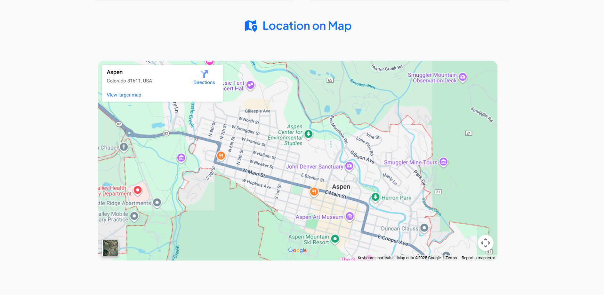

# 🚀 Airbnb Clone 🏠💻


A full-stack clone of the **Airbnb platform**, built using Node.js, Express, MongoDB, and EJS templating.

---

## 📖 Description

The **Airbnb Clone** is a full-stack web application that replicates essential features of Airbnb.  
It follows the **MVC architecture**, uses **Cloudinary** for image uploads, **Passport.js** for authentication, and **EJS** for server-side rendering.

This project is perfect for learning:

- Backend structure (routes, controllers, middleware)
- Authentication & session management
- Database modeling with Mongoose
- REST API development
- Cloudinary file uploads
- Data validation & error handling
- EJS templating

---

## ✨ Features

### 🔐 User Authentication
- Register & Login using Passport.js  
- Secure password hashing  
- Session-based authentication  

### 🏡 Listing Management
- Create / View / Edit / Delete listings  
- Add price, location, description, category
- Upload multiple images (Cloudinary)  
- Search by title and filter by categories 

### ⭐ Reviews System
- Add & delete reviews ( only Author )
- Ratings + comments  
- Linked with user & listing models  

### 🖼️ Image Upload
- Cloudinary + Multer  
- Secure and optimized image handling  

### 🎯 Filtering & Categories
Filter by:
- Category   
- Location  

Search by:
- title
  
### ⚠️ Error Handling
- Custom error handler (ExpressError)
- wrapAsync utility to eliminate try–catch blocks

### 💻 Responsive UI
- Modular EJS templates (Navbar, Footer, Flash messages)
- Modern, clean UI using custom CSS

---

## 🧰 Tech Stack

| Layer          | Technology                   |
|----------------|------------------------------|
| Frontend       | EJS + Custom CSS + bootstrap |
| Backend        | Node.js + Express.js         |
| Database       | MongoDB (Mongoose ORM)       |
| Authentication | Passport.js                  |
| Image Upload   | Cloudinary + Multer          |
| Validation     | Joi Schema Validation        |
| Architecture   | MVC Pattern                  |

---

## ⚙️ How to Run

### 1️⃣ Clone the Repository
```bash
git clone https://github.com/Adityasaw8180/Airbnb-clone.git
cd Airbnb-clone
```

### 2️⃣ Install Dependencies
```bash
npm install
```

### 3️⃣ Setup Environment Variables  
Create `.env` file and add:

```
PORT=8080
CLOUD_NAME=your_cloud_name
CLOUD_API_KEY=your_api_key
CLOUD_API_SECRET=your_api_secret
SECRET=your_session_secret
```

### 4️⃣ Run the App
```bash
npm start
```

### 5️⃣ Visit in Browser
```
http://localhost:8080
```

---

## 🧪 Testing Instructions

- signup and log in  
- Create, view, edit, and delete listings
- check listings location (map location inbuild )
- Upload images (Cloudinary)  
- Add reviews  
- Test filters  
- search by title
- Check error handling and validation  

---

## 📦 API Overview

| Method  | Endpoint                      | Description               |
|---------|-------------------------------|---------------------------|
| GET     | /listings                     | Display all listings      |
| POST    | /listings                     | Create new listing        |
| GET     | /listings/:id                 | View single listing       |
| PUT     | /listings/:id                 | Update listing            |
| DELETE  | /listings/:id                 | Delete listing            |
| GET     | /listings/category/:category  | Get listings by category |
| POST    | /reviews                      | Add review                |
| GET     | /reviews/:id                  | Get reviews for listing   |

---

## 👤 Author  
**Aditya Sawant** 🙋‍♂️  
GitHub: [Adityasaw8180](https://github.com/Adityasaw8180)

---

## 📸 Screenshots

  
  
  
  
  
  


---

## 📁 Project Structure
```
📁 Project Structure
├── controllers/
│   ├── listings.js
│   ├── reviews.js
│   └── users.js
├── init/
│   ├── data.js
│   └── index.js
├── models/
│   ├── listing.js
│   ├── review.js
│   └── user.js  
├── public/
│   ├── css/
│   │   ├── rating.css
│   │   └── style.css
│   ├── images/
│   │   └── airbnb.png
│   └── js/
│       └── script.js
├── routes/
│   ├── listing.js
│   ├── review.js
│   └── user.js
├── screenshots/
├── utils/
│   ├── ExpressError.js
│   └── wrapAsync.js
├── views/
│   ├── includes/
│   │   ├── flash.ejs
│   │   ├── footer.ejs
│   │   └── navbar.ejs
│   ├── layouts/
│   │   └── boilerplate.ejs
│   ├── listings/
│   │   ├── edit.ejs
│   │   ├── index.ejs
│   │   ├── new.ejs
│   │   └── show.ejs
│   ├── users/
│   │   ├── userLogin.ejs
│   │   └── userSignUp.ejs
│   └── error.ejs
├── .env
├── .gitignore
├── cloudConfig.js
├── middlewares.js
├── schemaValidation.js
├── package.json
├── package-lock.json
├── README.md
└── server.js
```
GitHub: [Adityasaw8180](https://github.com/Adityasaw8180)

---

